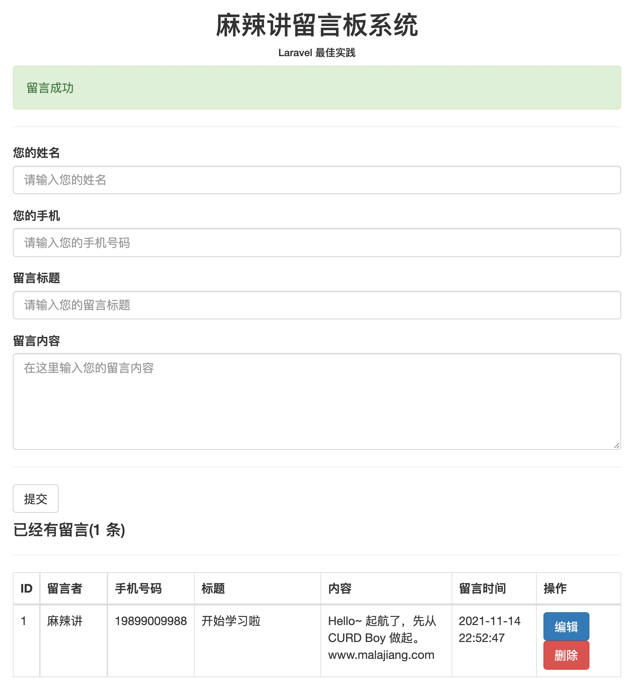
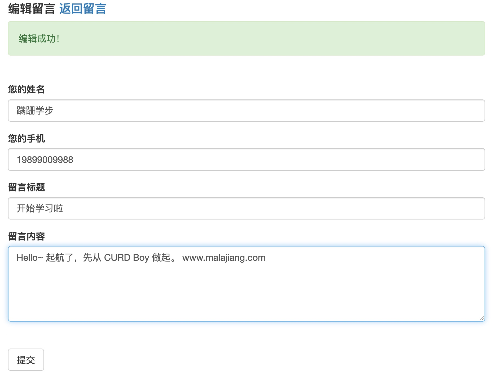

对应课程：Laravel 8 开发留言板  
课程地址：https://www.malajiang.com/course/1  
演示地址：待更新   
注意：❗️❗️❗️❗️❗️此课程也是【PHP 全栈工程师之路】基础实战应用的脚手架项目。Laravel 基础应用部分的周边和专栏，都会基于此项目进行演示和讲解。商业和高级应用部分的脚手架，请关注当前仓库下的（laravel-shop）项目。  

---
**首页截图**  

**编辑页截图**  
